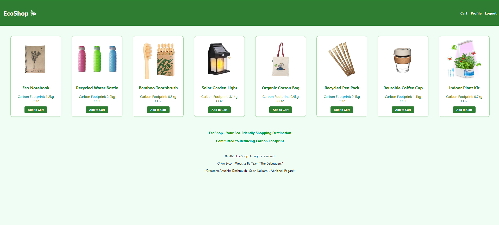
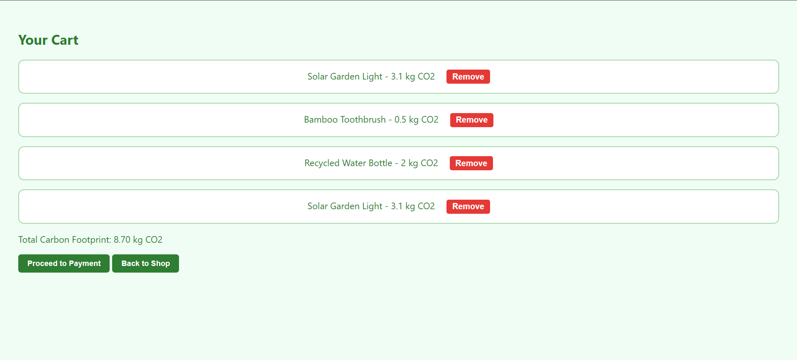
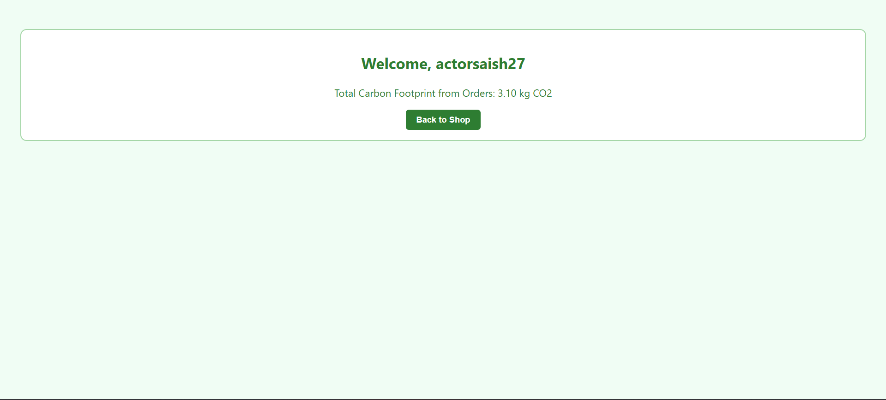

# 🌿 EcoShop – Sustainable E-Commerce

EcoShop is a simple, eco-themed e-commerce project built with **HTML**, **CSS**, and **JavaScript**.  
It allows users to browse sustainable products, add them to a cart, track carbon footprint, and simulate login/logout


## 🚀 Features

- 🛍️ Product listing with carbon footprint
- 🛒 Add to cart with total CO2 tracking
- 🔐 Login simulation using session storage
- 👤 Profile page showing total carbon usage
- ❌ Remove item from cart
- ↩️ Back to shop button on cart & profile pages
- 📱 Responsive green-white theme
- 🌱 Eco branding with logo and footer

---

## 📁 Folder Structure

```
eco-frontend/
│
├── index.html          # Home / Shop Page
├── login.html          # Login screen
├── cart.html           # Cart with remove functionality
├── profile.html        # Profile page with CO2 summary
│
├── css/
│   └── style.css       # Global styles (green-white theme)
│
├── js/
│   └── main.js         # Cart logic (add/remove products)
│
├── assets/
│   └── *.jpg / *.png   # Product images, logos
│
└── README.md           # Project documentation
```

---

## 🔧 How to Run

1. **Download or Clone** the repository
2. Open `login.html` in your browser
3. Log in with any dummy email and password
4. Enjoy shopping sustainably 🌍

---

## 📸 Screenshots

### 🏠 Home Page


### 🛒 Cart Page


### 🔐 Login Page



---

## ✨ Team

Made with 💚 by **Team "The Debuggers"**

---

## 📄 License

This project is open-source and free to use for learning and personal projects.
